<p align="center">
  
</p>

<h1 align="center">Copilot Insights</h1>

<p align="center">
  <strong>Understand how you work with AI. Build the skills to do it better.</strong><br/>
  A community-built dashboard and Copilot CLI extension that analyzes your AI coding sessions<br/>to help you build stronger AI collaboration skills over time.
</p>

> **Note:** This is an independent, community-built project. It is not affiliated with, endorsed by, or sponsored by GitHub or Microsoft. "GitHub Copilot" is a trademark of GitHub, Inc.

> **Scope:** Currently supports [GitHub Copilot CLI](https://docs.github.com/en/copilot) sessions only. IDE-based Copilot usage is not yet supported.

<p align="center">
  <a href="https://github.com/jackbatzner/copilot-insights/actions/workflows/ci.yml"></a>
  <a href="https://github.com/jackbatzner/copilot-insights/releases/latest"></a>
  <a href="LICENSE"></a>
</p>

<p align="center">
  <a href="#quick-start">Quick Start</a> •
  <a href="#dashboard">Dashboard</a> •
  <a href="#cli-tools">CLI Tools</a> •
  <a href="#how-it-works">How It Works</a>
</p>

---

## Why?

Every time you say "no, not that" or "go back to the previous approach," that's signal. It means there's a gap between what you asked for and what the agent did. **Copilot Insights** surfaces those moments so you can learn from them.

- 📊 **See your patterns** — Which corrections do you make most often?
- 🎯 **Skill Building** — 7-pillar WTI framework with dev plan, retros, and progress tracking
- 💡 **Get coaching** — Personalized dev plans, daily check-ins, and retros
- 📈 **Watch your trends** — Pillar scores over 7/30/90 days or all time
- 🔍 **Replay sessions** — Annotated turn-by-turn session replay
- 🧪 **Practice prompting** — Sandbox for instant feedback + rewrite challenges with coaching nudges
- 💻 **VS Code Sessions** — Analyze Copilot sessions from VS Code / VS Code Insiders
- 📡 **Live monitoring** — Real-time feed of corrections as they happen
- 💰 **Token usage & cost** — Track spend by model, get optimization tips, budget projections
- 🌗 **Dark & light mode** — System-aware theme with manual toggle and localStorage persistence
- ♿ **Accessible** — Full WAI-ARIA keyboard navigation, semantic HTML, focus-visible styles

Inspired by [this investigation](https://dfberry.github.io/#if-youre-building-an-agent-on-top-of-copilot) into using Copilot session data as telemetry for agent improvement.

## What It Detects

| Category | Examples |
|----------|----------|
| 🔄 **Iterative Refinement** | "no, that's wrong", "not what I asked", "this is wrong" |
| ↩️ **Course Change** | "actually, do X instead", "scratch that", "I changed my mind" |
| 💬 **Clarification Needed** | "still broken", "I already said", "why did you do that" |
| 🔁 **Reinforced Instruction** | "like I said", "one more time", "again" |
| 🔀 **Direction Change** | "undo that", "go back", "revert", "change it back" |

It also detects **repeated file edits** — when the same file is edited 3+ times in a session, which often indicates unclear requirements.

## Quick Start

### Prerequisites

- **Node.js 20+**
- **[Copilot CLI](https://docs.github.com/en/copilot/using-github-copilot/using-github-copilot-in-the-command-line)** installed and used at least once (creates `~/.copilot/session-store.db`)
- **OS:** macOS, Linux, or Windows

### 1. Install

**Option A: Install from GitHub**

```bash
npm i -g jackbatzner/copilot-insights
copilot-insights
# → http://localhost:3002
```

**Option B: From source**

```bash
git clone https://github.com/jackbatzner/copilot-insights.git
cd copilot-insights
npm run setup
```

### 2. Launch the Dashboard

```bash
copilot-insights   # if installed from GitHub
npm start          # if installed from source
# → http://localhost:3002
```

Open [http://localhost:3002](http://localhost:3002) to see your dashboard.

### 3. Use as a Copilot CLI Extension (optional)

This repo follows the official Copilot CLI extension layout: `.github/extensions/copilot-insights/extension.mjs`.

To get insights directly inside Copilot CLI chat from a global or source install, link the packaged extension directory into your Copilot user extensions folder:

```bash
copilot-insights link    # if installed globally
node bin/cli.mjs link    # if running from source
```

To remove the extension later:

```bash
copilot-insights unlink    # if installed globally
node bin/cli.mjs unlink    # if running from source
```

Then reload extensions (`/extensions reload`) or restart Copilot CLI. The extension registers 8 tools that the agent can invoke:

```
> How am I doing with my prompting?          → insights_summary
> Scan my recent sessions                    → insights_analyze
> What are my most common correction patterns? → insights_patterns
> Compare sessions abc123 and def456         → insights_compare
> Coach this prompt before I send it         → insights_coach
> Launch the insights dashboard              → insights_dashboard
> Stop the dashboard                         → insights_stop
```

## Dashboard

First-time users are greeted with a **Welcome walkthrough** that explains what the tool does before diving in:

<p align="center">
  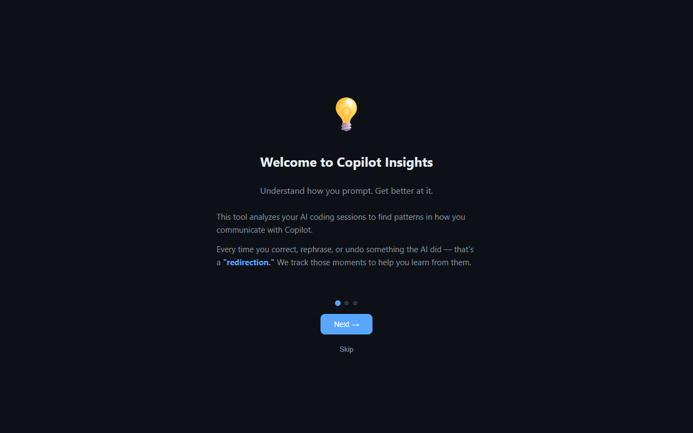
</p>

The main dashboard uses **progressive disclosure** — new users see the key insight, quick stats, and clear next steps. Deeper data is available in collapsible sections. Navigation is organized into **Core** (Overview, Skill Building, Practice Lab, Sessions) and **Advanced** (Token Usage, Analytics, Live, Instructions, VS Code) groups:

<p align="center">
  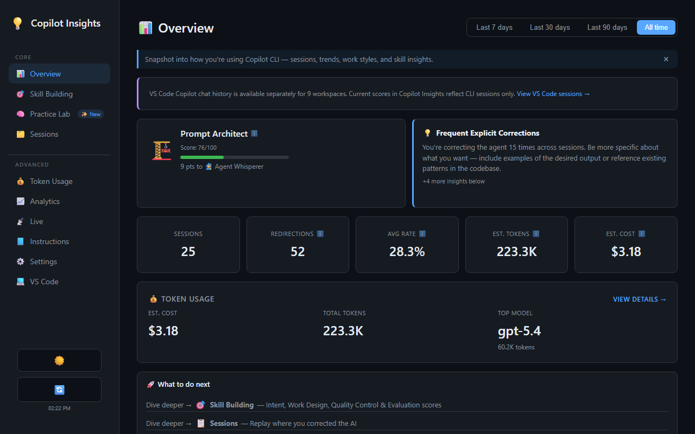
</p>

<p align="center">
  
</p>

<details>
<summary>📸 More screenshots</summary>

**Sessions list** — sortable, filterable by repo, hide noisy sessions from analysis


**Skill Building** — 7-pillar WTI framework with dev plan, retros, and Chronicle tips

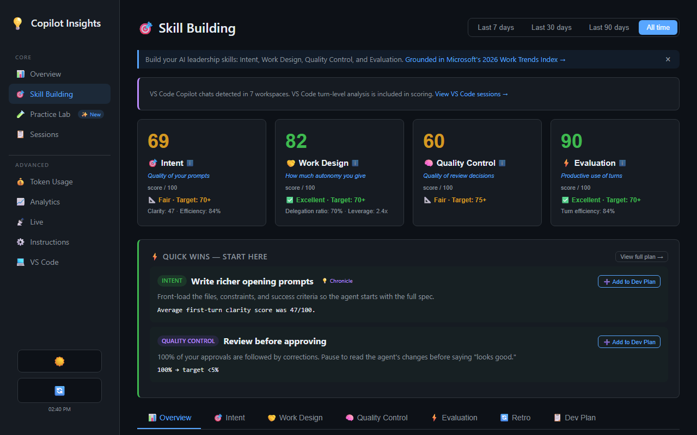

**Coaching** — delegation, judgment, and feedback analysis with tips

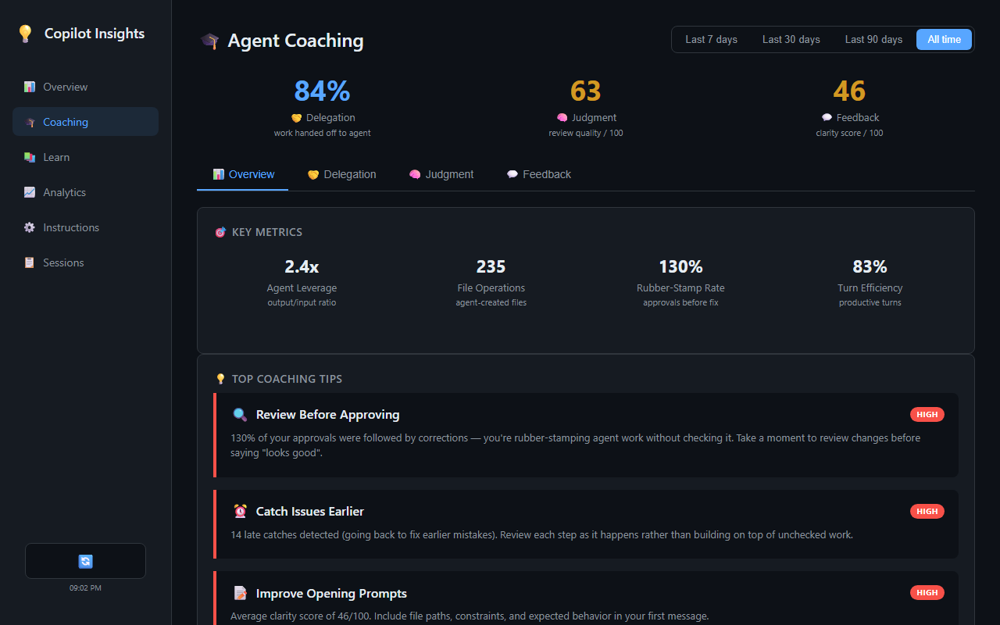

**Analytics** — work style, prompt length, session depth

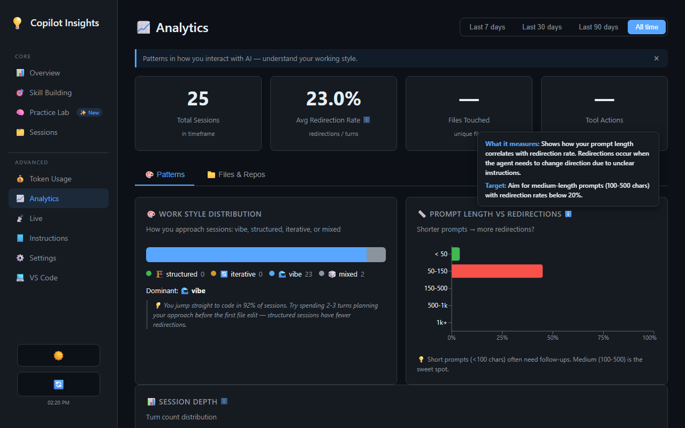

**Learn & Grow** — personalized dev plan, check-ins, retros

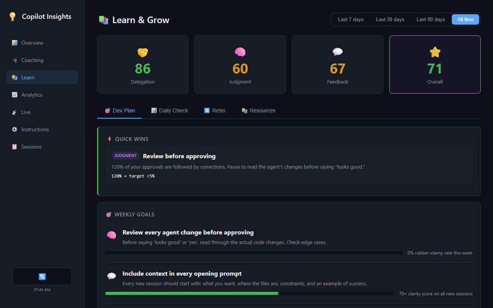

**Practice Lab** — sandbox for instant prompt feedback + rewrite challenges with coaching panel

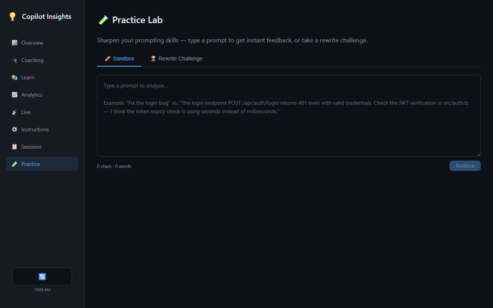

**Instructions** — convention gap analysis with copy-paste snippets

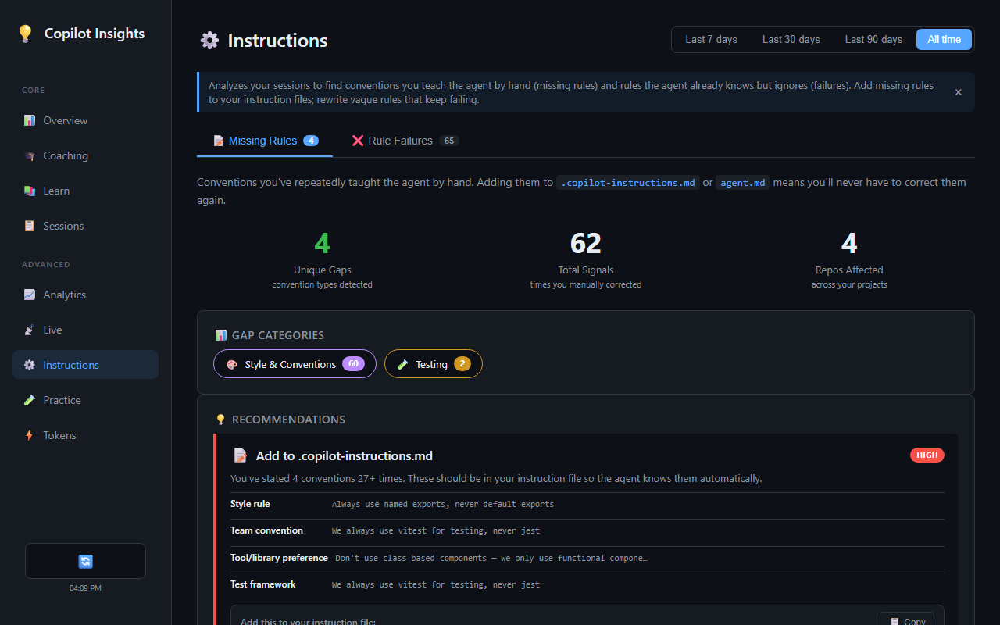

**Session Detail** — turn-by-turn replay with annotations

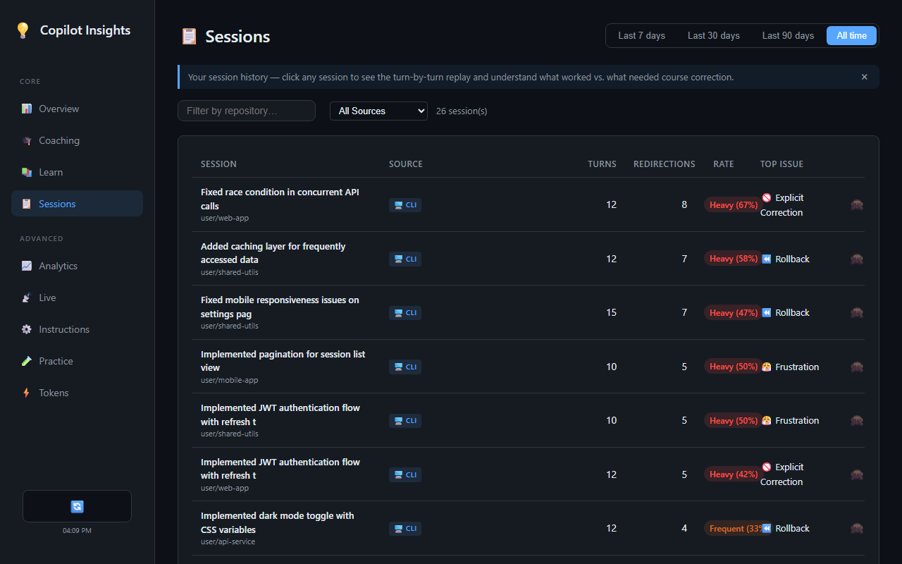

**Live Monitor** — real-time feed with pattern badges and coaching alerts

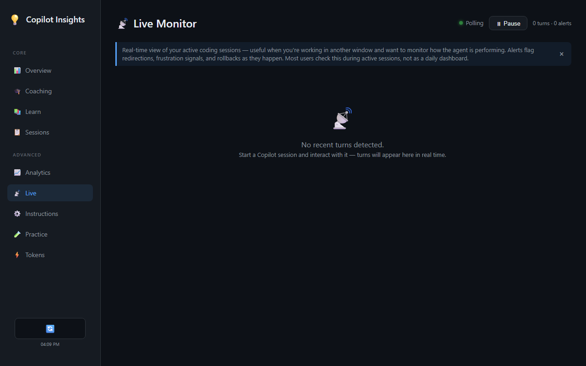

**VS Code Sessions** — analyze Copilot sessions from VS Code with turn-by-turn detail

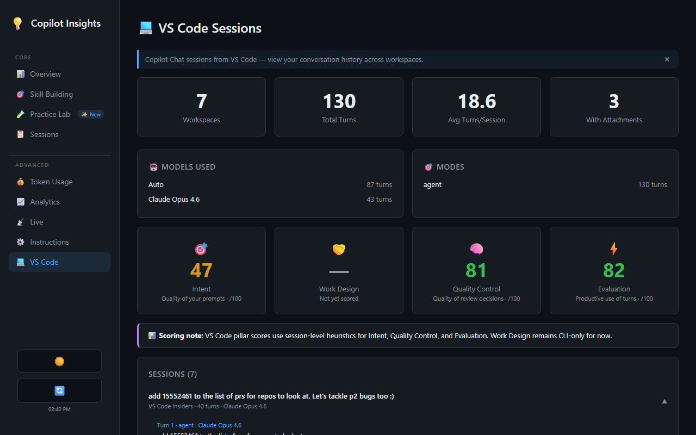

**Token Usage** — track spend by model, estimated costs, and usage trends

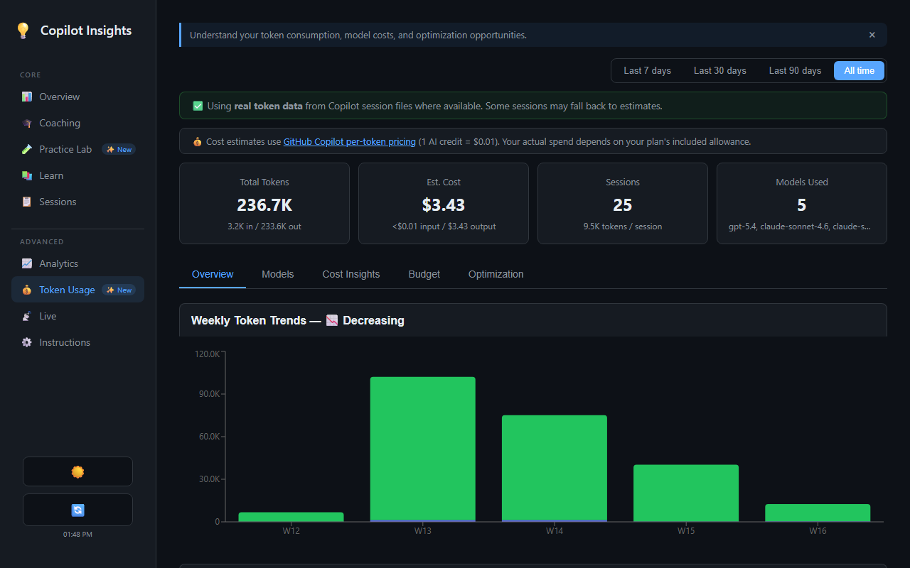

**Token Optimization** — personalized cost-saving tips, model recommendations, and savings plan

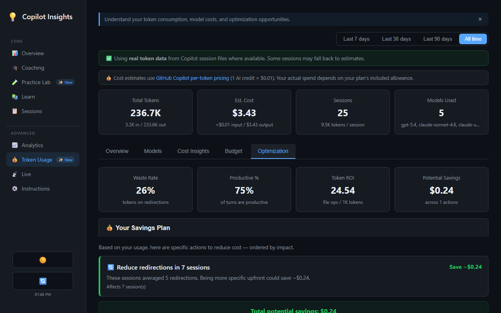

**Token Models** — per-model breakdown with costs and usage distribution

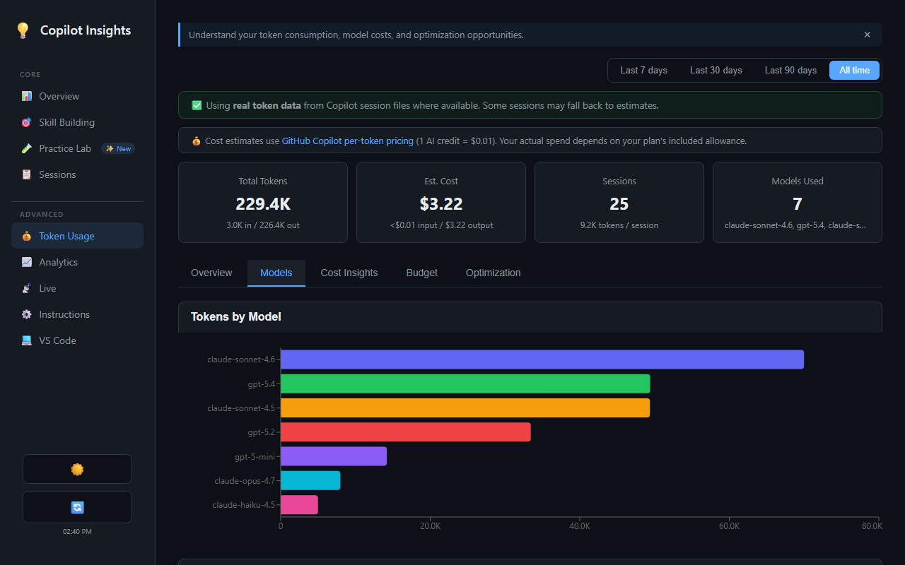

</details>

### Pages

- **Welcome** — 3-step onboarding for first-time users; always accessible via `/welcome`
- **Overview** — Tier hero card, collapsible stats/trends/skill growth/work style sections, prompting insights; "Since last visit" summary for returning users
- **Skill Building** — 7-pillar WTI framework (Intent, Work Design, Quality Control, Evaluation, plus Retro, Dev Plan, Overview) with pillar cards, tabbed deep-dives, trend detection with sample-size guard, Chronicle tips, and dev plan goal tracking
- **Sessions** — Sortable table of all sessions with redirections, filterable by repo; hide noisy sessions from analysis
- **Session Detail** — Turn-by-turn timeline showing exactly where corrections happened; hide/unhide from detail view
- **Analytics** — Hourly productivity, prompt length, repo health, tool usage
- **Practice Lab** — Sandbox for instant prompt feedback (score, pattern detection, coaching nudges) + rewrite challenges using your real sessions or curated examples
- **Instructions** — Custom instruction effectiveness analysis with ready-to-paste markdown snippets
- **VS Code Sessions** — Analyze Copilot sessions from VS Code and VS Code Insiders with turn-by-turn detail, retry on error, and expandable session cards
- **Live Monitor** — Real-time session feed with pattern badges, coaching alerts, pause/resume
- **Token Usage** — 5-tab dashboard (Overview, Models, Cost Insights, Budget, Optimization) tracking token spend by model, personalized cost-saving insights, model recommendations, budget projections, and live pricing from GitHub docs

All pages include a **timeframe selector** (7d / 30d / 90d / All time) that syncs across pages — change it once and every page updates. Your selection is persisted to localStorage.

The dashboard is **mobile responsive**: on small screens a hamburger menu replaces the sidebar, tables scroll horizontally, and the layout adapts to narrow viewports. **API caching** (60-second TTL on GET requests with LRU eviction at 200 entries) keeps navigation snappy, and the refresh button clears the cache for fresh data. **Hidden sessions** are persisted to disk (`~/.copilot/copilot-insights-hidden.json`) so they survive server restarts. **API resilience** includes `AbortController` with 30s timeout, `Promise.allSettled` for parallel requests, and retry buttons on error states.

### Practice Lab

The Practice Lab is an interactive sandbox for improving your prompting skills:

**🧪 Sandbox Mode** — Type any prompt and click **Analyze** to get instant feedback: a 0-100 score, pattern detection (vague language, missing context, etc.), quality checks, and actionable rewrite suggestions. Coaching nudges help you improve — "try mentioning the specific file" or "what should the result look like?"

**🏆 Rewrite Challenge** — Choose between your own low-scoring prompts ("My Bad Prompts") or a curated library of 80+ bad prompts covering best practices from GitHub, Anthropic, Google, and OpenAI. Filter by topic (vague prompts, missing constraints, no examples, etc.), rewrite the prompt, and see your score improve. Before you rewrite, a **coaching panel** shows what's wrong: detected problems, missing quality signals, and before/after rewrite examples — so you know exactly what to fix. Personalized recommendations highlight which categories need the most work based on your real session patterns.

Scoring is based on heuristics derived from published prompting guides — see [docs/prompting-resources.md](docs/prompting-resources.md) for the full list of sources.

### Live Monitor

The Live Monitor polls your session database every 5 seconds for new turns and displays them in a live feed. Each turn is annotated with detected redirection patterns shown as colored badges. When a high-severity pattern (weight ≥ 3) is detected, an inline coaching card appears with contextual tips.

- **Pause/resume** — Stop and restart polling with one click
- **Status indicator** — Green pulsing dot when active, yellow when paused
- **Coaching alerts** — Actionable advice for iterative refinements, clarification needs, direction changes, etc.

## CLI Tools

| Tool | Description |
|------|-------------|
| `insights_analyze` | Scan recent sessions, ranked by correction severity |
| `insights_session` | Deep-dive a specific session with turn-by-turn timeline |
| `insights_patterns` | Most common correction patterns with real examples |
| `insights_summary` | Quick snapshot: tier badge, pillar scores, coaching tip |
| `insights_compare` | Compare two sessions side-by-side |
| `insights_coach` | Prompt coaching: immediate feedback, periodic review, and progress tracking |
| `insights_dashboard` | Launch the web dashboard from the CLI |
| `insights_stop` | Stop the dashboard server |

## How It Works

The extension reads from `~/.copilot/session-store.db` (read-only), the SQLite database where Copilot CLI stores session history. It scans user messages against 30+ regex patterns, categorizes matches, and scores the results. For token usage analysis, it also reads JSONL event files from `~/.copilot/session-state/` which contain real model and token count data. VS Code sessions are read from `state.vscdb` files in VS Code's workspace storage.

```
~/.copilot/session-store.db (read-only)
  → Read user messages from turns table
  → Match against 30+ correction patterns
  → Categorize and aggregate
  → Chronicle builder: clean messages, classify intent

~/.copilot/session-state/*/events.jsonl (read-only)
  → Read real token usage & model data
  → Estimate costs using official GitHub Copilot pricing
  → Generate personalized optimization tips

VS Code workspace storage (read-only)
  → Discover VS Code / VS Code Insiders sessions
  → Analyze clarity, delegation, judgment, efficiency

  → Serve via Express API → React dashboard
```

**Privacy:** All data stays local. The tool only reads your existing session database — it never writes to it, and nothing is sent to external services.

## Development

```bash
# UI dev mode (hot reload on :5174, proxies API to :3002)
cd ui && npm run dev

# Server dev mode (auto-restart on changes)
cd server && npm run dev
```

See [CONTRIBUTING.md](CONTRIBUTING.md) for contribution guidelines.

### Releasing

```bash
npm run release patch         # 0.1.0 → 0.1.1
npm run release minor         # 0.1.0 → 0.2.0
npm run release major         # 0.1.0 → 1.0.0
npm run release 0.2.0-beta.1  # explicit version
npm run release patch --dry-run  # preview without changes
```

This bumps versions, updates the changelog, commits, tags, and pushes. GitHub Actions then creates the release automatically.

## Architecture

```mermaid
graph LR
    subgraph "Data Source"
        DB[(~/.copilot/session-store.db)]
        JSONL[(~/.copilot/session-state/*.jsonl)]
        VSCDB[(VS Code state.vscdb)]
    end

    subgraph "Analysis Engine"
        DB -->|read-only| Analyzer[analyzer.mjs]
        JSONL -->|token data| Tokens[tokens.mjs]
        VSCDB -->|read-only| VSCode[vscode-sessions.mjs]
        Analyzer --> Patterns[30+ regex patterns]
        Analyzer --> Pillars[Clarity · Efficiency · Delegation]
        Analyzer --> Tiers[Tier scoring]
        Tokens --> TokenAnalytics[token-analytics.mjs]
        Patterns --> Practice[practice.mjs]
        DB -->|polling| LiveFeed[/api/live/feed]
        LiveFeed --> Patterns
        DB --> Chronicle[chronicle.mjs]
        Chronicle --> IntentClassifier[intent-classifier.mjs]
        Chronicle --> DevPlan[dev-plan.mjs]
    end

    subgraph "Delivery"
        Analyzer --> API[Express API :3002]
        Practice --> API
        LiveFeed --> API
        TokenAnalytics --> API
        VSCode --> API
        Chronicle --> API
        DevPlan --> API
        API --> UI[React Dashboard]
        Analyzer --> CLI[Copilot CLI Extension]
        CLI --> Tools[8 insights_* tools]
    end
```

```
copilot-insights/
├── .github/
│   └── extensions/
│       └── copilot-insights/
│           └── extension.mjs  # Official discovered Copilot CLI entry point
├── src/
│   ├── db.mjs             # SQLite read-only access + batch query support
│   ├── patterns.mjs       # 30+ regex patterns, 5 categories
│   ├── analyzer.mjs       # Core analysis engine
│   ├── chronicle.mjs      # Session chronicle builder with message cleaning
│   ├── intent-classifier.mjs  # WTI-aligned intent classification
│   ├── dev-plan.mjs       # Personalized coaching & scoring
│   ├── vscode-sessions.mjs    # VS Code session discovery & analysis
│   ├── practice.mjs       # Prompt analysis for Practice Lab (no DB dependency)
│   ├── challenge-library.mjs  # 83 curated bad prompts with tags and hints
│   ├── tiers.mjs          # Tier badge system (shared UI + CLI)
│   ├── suggestions.mjs    # Prompt rewrite engine
│   ├── delegation.mjs     # Delegation analysis
│   ├── judgment.mjs       # Judgment analysis
│   ├── efficiency.mjs     # Efficiency scoring
│   ├── clarity.mjs        # Clarity scoring
│   ├── sprawl.mjs         # Tool/file sprawl detection
│   ├── instructions.mjs   # Convention gap analysis
│   ├── instruction-failures.mjs  # Instruction failure detection
│   ├── session-insights.mjs  # Per-session improvement suggestions
│   ├── work-style.mjs     # Work style analysis
│   ├── trends.mjs         # Time-series trend detection
│   ├── tokens.mjs         # Token usage estimation, JSONL reader, model pricing
│   ├── token-analytics.mjs # Cost insights, model recommendations, savings plan
│   └── formatter.mjs      # Markdown formatting (CLI output)
├── server/
│   └── index.mjs          # Express API + static UI + atomic writes + write mutex
├── ui/src/
│   ├── pages/
│   │   ├── SkillBuilding/     # Decomposed skill building module
│   │   │   ├── index.jsx      # Orchestrator (data loading, tabs, retry)
│   │   │   ├── DevPlanContext.jsx  # React context for dev plan state
│   │   │   ├── shared.jsx     # Shared components (AddToDevPlanButton, MiniStat, etc.)
│   │   │   ├── OverviewTab.jsx, IntentTab.jsx, WorkDesignTab.jsx
│   │   │   ├── QualityControlTab.jsx, EvaluationTab.jsx
│   │   │   ├── RetroTab.jsx, DevPlanTab.jsx
│   │   │   └── (7 tab components total)
│   │   ├── Overview.jsx, Welcome.jsx, Sessions.jsx, SessionDetail.jsx
│   │   ├── Analytics.jsx, Practice.jsx, Instructions.jsx
│   │   ├── VSCodeSessions.jsx, LiveMonitor.jsx, TokenUsage.jsx
│   │   └── (12 pages total)
│   ├── components/        # TabBar, CollapsibleSection, EmptyState, MetricHelp, etc.
│   └── api.js             # API client with safeFetch, LRU cache, AbortController
├── docs/
│   ├── prompting-resources.md  # Official guides, academic papers, scoring reference
│   └── screenshots/       # Auto-captured screenshots and demo GIF
├── scripts/               # Mock data seeder + screenshot/GIF capture
└── .github/workflows/     # CI + Release (GitHub Releases)
```

## License

[MIT](LICENSE)

## Disclaimer

This project is not affiliated with, endorsed by, or sponsored by GitHub or Microsoft. "GitHub Copilot" and "Copilot" are trademarks of GitHub, Inc. This project uses the name "Copilot Insights" solely to describe its function as a tool that works with GitHub Copilot CLI session data.

## Troubleshooting

**"No sessions found" / empty dashboard**
- You need at least one Copilot CLI session. Run `copilot` in any repo to create one.
- Check the database exists: `ls ~/.copilot/session-store.db`

**"Port 3002 already in use"**
- Kill the existing process, or use a different port: `PORT=3003 npm start`

**"Cannot find module 'better-sqlite3'"**
- Run `npm run setup` in the project root to install all dependencies.

**"Copilot session DB is missing required tables"**
- Your `~/.copilot/session-store.db` may be from an incompatible Copilot CLI version.
- Update Copilot CLI and try again, or [open an issue](https://github.com/jackbatzner/copilot-insights/issues).

**Dashboard loads but shows errors**
- Ensure the server is running (`npm start`) before opening the dashboard.
- Check the terminal for server-side error messages.

## Future Ideas

- **Gamification** — Scoring, XP, levels, achievements, and goals to encourage improvement
- **Team leaderboards** — Anonymous comparison across teams
- **Custom instruction generation** — Auto-generate `.github/copilot-instructions.md` from common patterns
- **OpenTelemetry tracing** — Opt-in distributed tracing via `@github/copilot-sdk` for debugging
