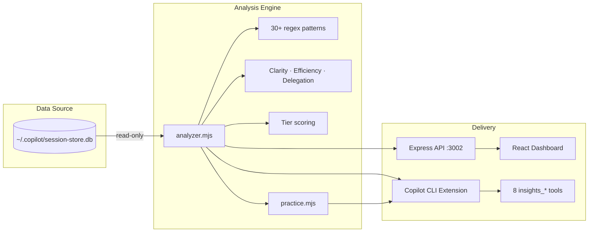

<p align="center">
  
</p>

<h1 align="center">Copilot Insights</h1>

<p align="center">
  <strong>Understand how you prompt. Get better at it.</strong><br/>
  A community-built dashboard and Copilot CLI extension that analyzes your AI coding sessions<br/>to help you communicate more effectively with AI agents.
</p>

> **Note:** This is an independent, community-built project. It is not affiliated with, endorsed by, or sponsored by GitHub or Microsoft. "GitHub Copilot" is a trademark of GitHub, Inc.

<p align="center">
  <a href="https://github.com/jackbatzner/copilot-insights/releases/latest"></a>
  <a href="LICENSE"></a>
</p>

<p align="center">
  <a href="#quick-start">Quick Start</a> •
  <a href="#dashboard">Dashboard</a> •
  <a href="#cli-tools">CLI Tools</a> •
  <a href="#how-it-works">How It Works</a>
</p>

---

## Why?

Every time you say "no, not that" or "go back to the previous approach," that's signal. It means there's a gap between what you asked for and what the agent did. **Copilot Insights** surfaces those moments so you can learn from them.

- 📊 **See your patterns** — Which corrections do you make most often?
- 🤖 **Real-time coaching** — Get instant feedback on your prompts as you work in Copilot CLI
- 💡 **Get coaching** — Personalized dev plans, daily check-ins, and retros
- 📈 **Watch your trends** — Pillar scores over 7/30/90 days or all time
- 🔍 **Replay sessions** — Annotated turn-by-turn session replay

Inspired by [this investigation](https://dfberry.github.io/#if-youre-building-an-agent-on-top-of-copilot) into using Copilot session data as telemetry for agent improvement.

## What It Detects

| Category | Examples |
|----------|----------|
| 🚫 **Explicit Correction** | "no, that's wrong", "not what I asked", "this is wrong" |
| ↩️ **Course Change** | "actually, do X instead", "scratch that", "I changed my mind" |
| 😤 **Frustration Signal** | "still broken", "I already said", "why did you do that" |
| 🔁 **Repeated Instruction** | "like I said", "one more time", "again" |
| ⏪ **Rollback Request** | "undo that", "go back", "revert", "change it back" |

It also detects **file thrashing** — when the same file is edited 3+ times in a session, which often indicates unclear requirements.

## Quick Start

### Prerequisites

- **Node.js 18+**
- **[Copilot CLI](https://docs.github.com/en/copilot/using-github-copilot/using-github-copilot-in-the-command-line)** installed and used at least once (creates `~/.copilot/session-store.db`)
- **OS:** macOS, Linux, or Windows

### 1. Install

**Option A: Install from GitHub**

```bash
npm i -g jackbatzner/copilot-insights
copilot-insights
# → http://localhost:3002
```

**Option B: From source**

```bash
git clone https://github.com/jackbatzner/copilot-insights.git
cd copilot-insights
npm run setup
```

### 2. Launch the Dashboard

```bash
copilot-insights   # if installed from GitHub
npm start          # if installed from source
# → http://localhost:3002
```

Open [http://localhost:3002](http://localhost:3002) to see your dashboard.

### 3. Use as a Copilot CLI Extension (optional)

To get insights directly inside Copilot CLI chat, install it as an extension.

**If you installed globally** (`npm i -g`), the extension is linked automatically — no extra steps needed.

You can also manage the link manually:

```bash
copilot-insights link     # create the symlink
copilot-insights unlink   # remove the symlink
```

Then restart Copilot CLI. The extension registers 8 tools that the agent can invoke:

```
> How am I doing with my prompting?          → insights_summary
> Scan my recent sessions                    → insights_analyze
> What are my most common correction patterns? → insights_patterns
> Compare sessions abc123 and def456         → insights_compare
> Coach me on my recent prompts              → insights_coach
> Launch the insights dashboard              → insights_dashboard
```

## Dashboard

The web dashboard gives you a full view of your prompting habits:

<p align="center">
  
</p>

<details>
<summary>📸 More screenshots</summary>

**Sessions list** — sortable, filterable by repo


**Coaching** — delegation, judgment, and feedback analysis with tips


**Analytics** — work style, prompt length, session depth


**Learn & Grow** — personalized dev plan, check-ins, retros


**Session Detail** — turn-by-turn replay with annotations


</details>

### Pages

- **Overview** — Stats cards, trend chart, category donut, pillar trends, work-style analysis
- **Learn & Grow** — Personalized dev plan, daily check-in, retros, resources
- **Sessions** — Sortable table of all sessions with redirections, filterable by repo
- **Session Detail** — Turn-by-turn timeline showing exactly where corrections happened
- **Analytics** — Hourly productivity, prompt length, repo health, tool usage
- **Coaching** — Delegation, judgment, and instruction gap analysis
- **Instructions** — Custom instruction effectiveness analysis

All pages include a **timeframe selector** (7d / 30d / 90d / All time).

## CLI Tools

| Tool | Description |
|------|-------------|
| `insights_analyze` | Scan recent sessions, ranked by correction severity |
| `insights_session` | Deep-dive a specific session with turn-by-turn timeline |
| `insights_patterns` | Most common correction patterns with real examples |
| `insights_summary` | Quick snapshot: tier badge, pillar scores, coaching tip |
| `insights_compare` | Compare two sessions side-by-side |
| `insights_coach` | Real-time prompt coaching — immediate feedback, periodic review, or progress tracking |
| `insights_dashboard` | Launch the web dashboard from the CLI |
| `insights_stop` | Stop the dashboard server |

<details>
<summary>🎓 <strong>insights_coach</strong> — example output for each mode</summary>

**Immediate mode** — the agent passes the user's message for real-time feedback:

```markdown
## 🎓 Prompt Coach — 🟠 52/100 (C)

**Detected:**
- 😤 **Frustration Signal**: Persistent failure
- 🚫 **Explicit Correction**: Direct rejection

### 💡 Coaching
**Diagnose, don't repeat** — Describe what you see vs. what you expected, and share error messages.
> ✏️ *Instead of 'still broken', try: 'The server returns 200 but the UI shows empty — check the response parsing.'*

**Be specific upfront** — Include the exact tool, file, or approach you want from the start.
> ✏️ *State your preferred approach in the first message: 'Use X (not Y) because…'*
```

**Periodic mode** — reviews the last N turns across recent sessions:

```markdown
## 🎓 Periodic Coaching Review (last 10 turns)

**Average score:** 71/100
**Turns with issues:** 4/10

### Top Issues

| Category | Count |
|----------|------:|
| ↩️ Course Change | 3 |
| 😤 Frustration Signal | 2 |

### Turns Needing Attention

🔴 **Score 44** — Turn 3
> Actually, scratch that. Use a different approach entirely…
> 💡 *Plan before you prompt: Use plan mode for complex tasks — outline the approach first.*

🟡 **Score 68** — Turn 7
> That didn't work, the tests are still failing…
> 💡 *Diagnose, don't repeat: Describe what you see vs. what you expected, and share error messages.*
```

**Progress mode** — tracks score trends over time:

```markdown
## 🎓 Progress Report (30d)

**Current tier:** ⚡ Flow State — **62/100**
**Trend:** 📈 Improving

### Score Trend
2026-W14  ████████████░░░░░░░░  55
2026-W15  ████████████░░░░░░░░  58
2026-W16  ████████████░░░░░░░░  60
2026-W17  █████████████░░░░░░░  62

### Pillar Scores

| Pillar | Score | Trend |
|--------|------:|:-----:|
| ⚖️ Judgment | 71/100 | 📈 improving |
| 🎯 Delegation | 63/100 | ➡️ stable |
| 💬 Feedback | 52/100 | 📈 improving |

**💪 Strongest:** ⚖️ Judgment (71/100)
**🎯 Focus area:** 💬 Feedback (52/100)

💡 **Next step:** When you need to correct the agent, explain *why* the output
was wrong, not just *what* to change. This reduces repeat corrections.
```

</details>

## How It Works

The extension reads from `~/.copilot/session-store.db` (read-only), the SQLite database where Copilot CLI stores session history. It scans user messages against 30+ regex patterns, categorizes matches, and scores the results.

```
~/.copilot/session-store.db (read-only)
  → Read user messages from turns table
  → Match against 30+ correction patterns
  → Categorize and aggregate
  → Serve via Express API → React dashboard
```

**Privacy:** All data stays local. The tool only reads your existing session database — it never writes to it, and nothing is sent to external services.

## Development

```bash
# UI dev mode (hot reload on :5174, proxies API to :3002)
cd ui && npm run dev

# Server dev mode (auto-restart on changes)
cd server && npm run dev
```

See [CONTRIBUTING.md](CONTRIBUTING.md) for contribution guidelines.

### Releasing

```bash
npm run release patch         # 0.1.0 → 0.1.1
npm run release minor         # 0.1.0 → 0.2.0
npm run release major         # 0.1.0 → 1.0.0
npm run release 0.2.0-beta.1  # explicit version
npm run release patch --dry-run  # preview without changes
```

This bumps versions, updates the changelog, commits, tags, and pushes. GitHub Actions then creates the release automatically.

## Architecture



```
copilot-insights/
├── extension.mjs          # Copilot CLI extension entry point (8 tools)
├── src/
│   ├── db.mjs             # SQLite read-only access
│   ├── patterns.mjs       # 30+ regex patterns, 5 categories
│   ├── analyzer.mjs       # Core analysis engine
│   ├── practice.mjs       # Shared prompt analyzer (pure function, no DB)
│   ├── tiers.mjs          # Tier badge system (shared UI + CLI)
│   ├── trends.mjs         # Weekly pillar-score trend computation
│   ├── suggestions.mjs    # Prompt rewrite engine
│   ├── analytics.mjs      # Session analytics (hourly, depth, tools)
│   ├── clarity.mjs        # Prompt clarity scoring
│   ├── efficiency.mjs     # Efficiency metrics
│   ├── delegation.mjs     # Delegation analysis
│   ├── judgment.mjs       # Judgment analysis
│   ├── sprawl.mjs         # Scope sprawl detection
│   ├── dev-plan.mjs       # Personalized coaching & dev plans
│   ├── replay.mjs         # Turn-by-turn session replay
│   ├── work-style.mjs     # Work style analysis
│   ├── session-insights.mjs # Per-session insight computation
│   ├── instructions.mjs   # Custom instruction analysis
│   ├── instruction-failures.mjs # Instruction failure detection
│   └── formatter.mjs      # Markdown formatting (CLI output)
├── server/
│   └── index.mjs          # Express API + static UI
├── ui/src/
│   ├── pages/             # Overview, Learn, Sessions, SessionDetail, Analytics, Coaching, Instructions
│   └── components/        # Charts, badges, timeline, insights
├── scripts/               # Mock data seeder + screenshot capture
└── .github/workflows/     # CI + Release (GitHub Releases)
```

## License

[MIT](LICENSE)

## Disclaimer

This project is not affiliated with, endorsed by, or sponsored by GitHub or Microsoft. "GitHub Copilot" and "Copilot" are trademarks of GitHub, Inc. This project uses the name "Copilot Insights" solely to describe its function as a tool that works with GitHub Copilot CLI session data.

## Troubleshooting

**"No sessions found" / empty dashboard**
- You need at least one Copilot CLI session. Run `copilot` in any repo to create one.
- Check the database exists: `ls ~/.copilot/session-store.db`

**"Port 3002 already in use"**
- Kill the existing process, or use a different port: `PORT=3003 npm start`

**"Cannot find module 'better-sqlite3'"**
- Run `npm run setup` in the project root to install all dependencies.

**Dashboard loads but shows errors**
- Ensure the server is running (`npm start`) before opening the dashboard.
- Check the terminal for server-side error messages.

## Future Ideas

- **Gamification** — Scoring, XP, levels, achievements, and goals to encourage improvement
- **Live monitoring** — Flag corrections as they happen in real-time
- **Custom instruction generation** — Auto-generate `.github/copilot-instructions.md` from common patterns
- **OpenTelemetry tracing** — Opt-in distributed tracing via `@github/copilot-sdk` for debugging
